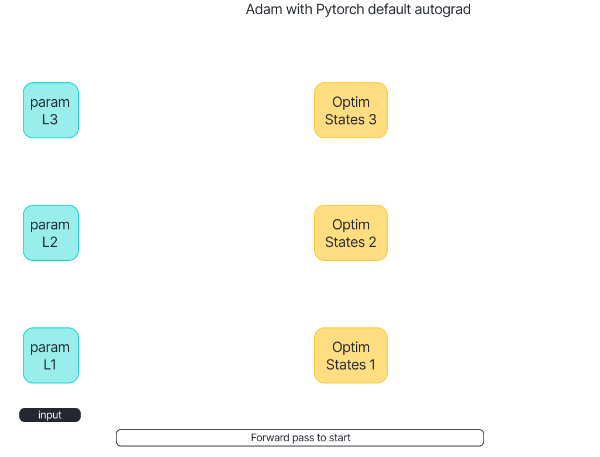
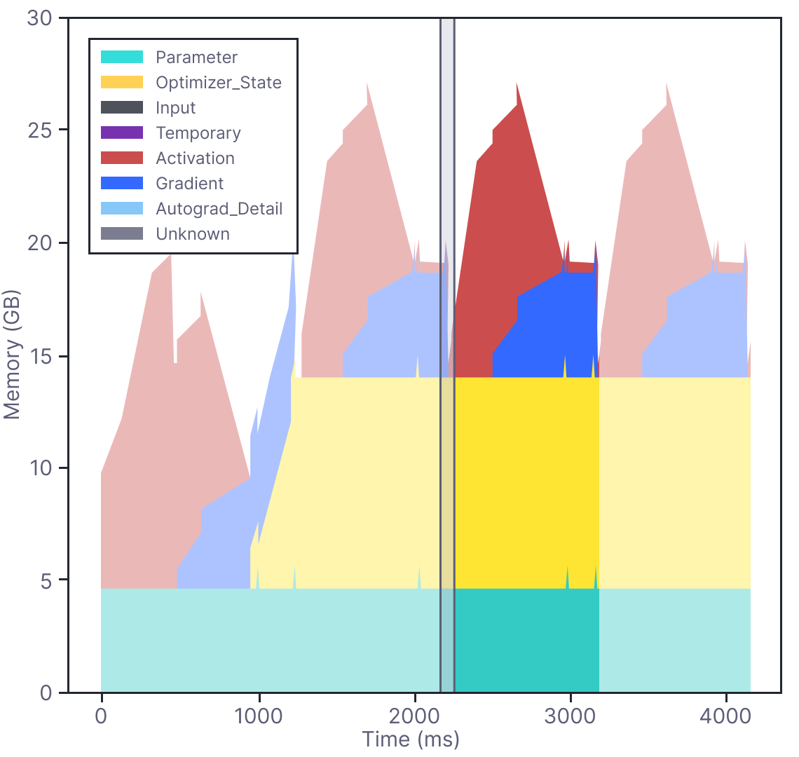
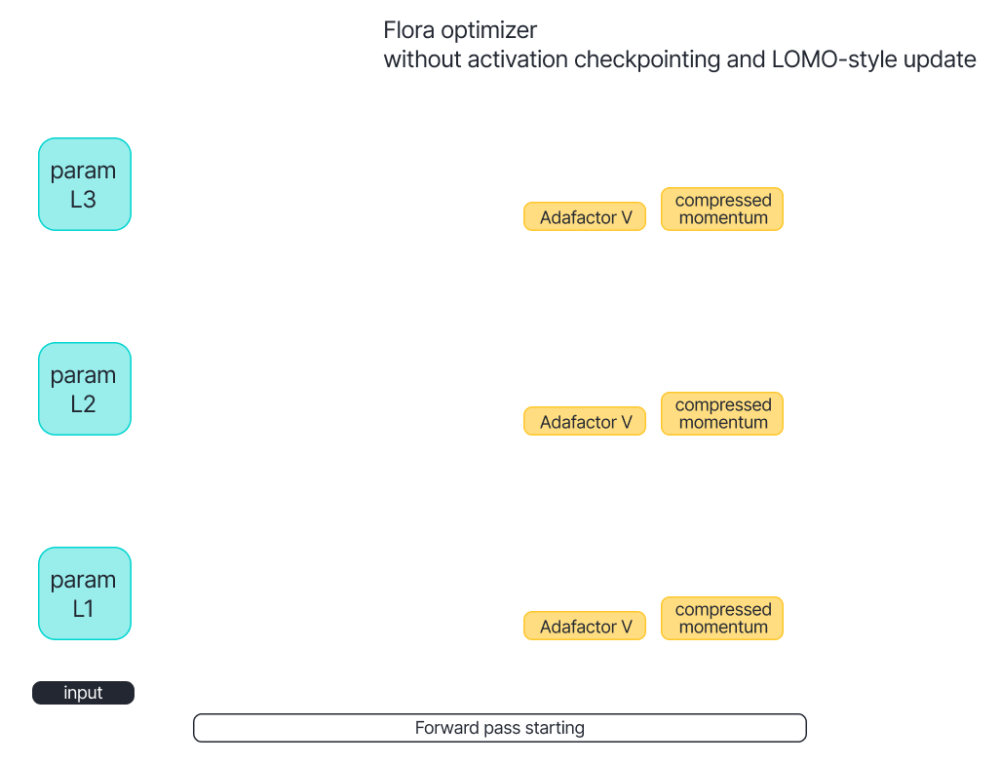
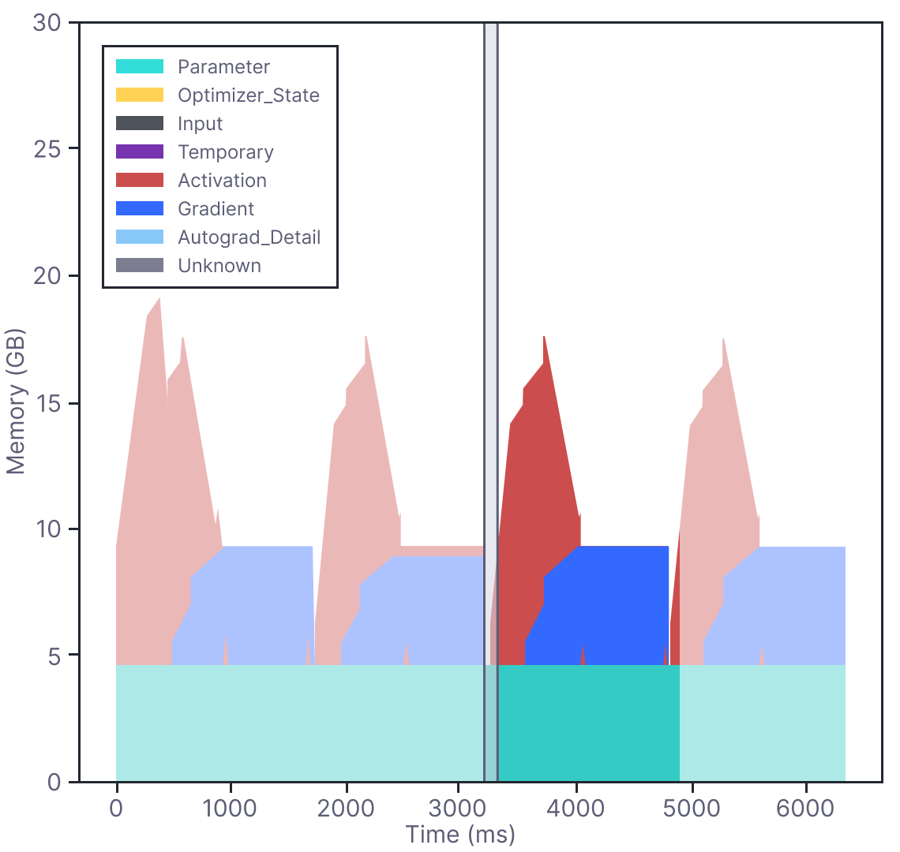
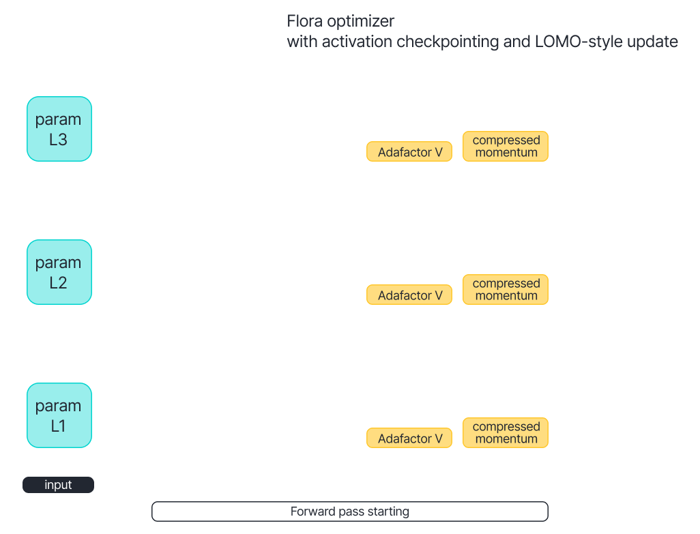
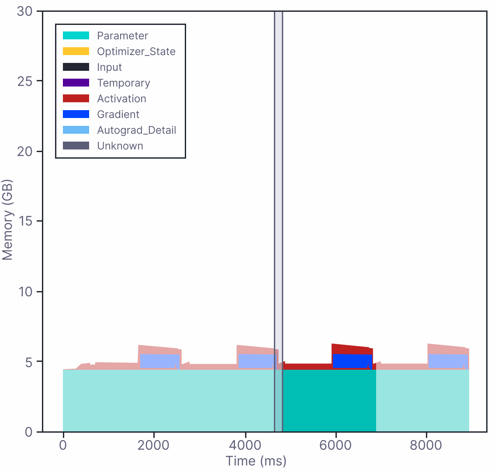

# 💐 Flora: Low-Rank Adapters Are Secretly Gradient Compressors

This is the official repository for the paper [Flora: Low-Rank Adapters Are Secretly Gradient Compressors](https://arxiv.org/abs/2402.03293) in ICML 2024. This repository contains the code for the experiments in the paper.

Flora dramatically decreases the GPU memory needed to pre-train and fine-tune models without compromising quality or causing significant slowdown. 


## Installation

You can install the library using pip:

```bash
pip install 'flora-opt[torch]' # for PyTorch
```

or

```bash
pip install 'flora-opt[jax]' # for JAX
```

## Usage

The library is designed to be compatible with huggingface libraries. You can use it as a drop-in replacement for huggingface libraries. Here is an example for PyTorch:

```diff
- optimizer = transformers.AdamW(model.parameters(), lr=1e-5)
+ optimizer = flora_opt.Flora(model.parameters(), lr=1e-5)
- accelerator = accelerate.Accelerator(**kwargs)
+ accelerator = flora_opt.FloraAccelerator(**kwargs)
```

Everything else remains the same. You can find more examples in the `examples` folder.

## How it works

Normally, there are three components in deep learning training: the model parameters, the optimizer, and the activations. Take the Adam optimizer as an example, the overall procedure is as follows:

| Procedure                                                | Memory                                                   |
| -------------------------------------------------------- | -------------------------------------------------------- |
|  |  |

Since Adam needs to store the first- and second-order moments for each parameter, the memory may double the size of the model.

In our work, instead of maintaining the optimizers' states, we propose to use low-rank random projections to compress the moments. The overall procedure is as follows:

| Procedure                                                 | Memory                                                    |
| --------------------------------------------------------- | --------------------------------------------------------- |
|  |  |

The low-rank random projections reduces the memory usage by a factor of `rank / d`, where `rank` is the rank of the low-rank random projections and `d` is the dimension of the model parameters. In addition, the low-rank random projections can be generated on-the-fly using the random seed, which further reduces the memory usage.

Moreover, Flora is compatible with the existing memory-efficient training techniques. For example, Flora can be combined with the activation checkpointing (AC) and layer-by-layer update (LOMO) to further reduce the memory usage, as shown below:

| Procedure                                                         | Memory                                                            |
| ----------------------------------------------------------------- | ----------------------------------------------------------------- |
|  |  |

In summary, Flora is a simple yet effective method to compress the optimizer's states, which can be easily integrated into existing training frameworks.

## Paper Replications (with JAX)

To replicate major experiments in the paper, run the following commands:

```bash
pip install -r examples/flax/requirements.txt
sh replicate.sh
```

You can also run individual experiments by selecting the corresponding script in the file `replicate.sh`.

## Explanation

The arguments for the `Flora` optimizer (for PyTorch) are explained below:

```python
flora_opt.Flora(
    params: Union[Iterable[torch.Tensor], Iterable[Dict[str, Any]]],  # model parameters
    lr: float = None,  # learning rate
    rank: int = None,  # rank of the low-rank random projections
    kappa: int = 1000,  # the interval for updating the low-rank random projections
    eps: tuple[float, float] = (1e-30, 1e-3),  # Adafactor parameter
    clip_threshold: float = 1.0,  # Adafactor parameter
    decay_rate: float = -0.8,  # decay rate in Adafactor
    beta1: Optional[float] = None,  # decay rate for the first moment
    weight_decay: float = 0.0,  # weight decay coefficient
    scale_parameter: bool = True,  # Adafactor parameter
    relative_step: bool = False,  # Adafactor parameter
    warmup_init: bool = False,  # Adafactor parameter
    factorize_second_moment: bool = True,  # use Adafactor or Adam
    seed: int = 0,  # random seed to generate the low-rank random projections
    quantization: bool = False,  # whether to quantize the states
)
```

For JAX, the arguments are similar. The translation can be found in `flora_opt/optimizers/torch/__init__.py`.

### Citation

```bibtex
@inproceedings{hao2024flora,
  title={Flora: Low-Rank Adapters Are Secretly Gradient Compressors},
  author={Hao, Yongchang and Cao, Yanshuai and Mou, Lili},
  booktitle={Forty-first International Conference on Machine Learning},
  url={https://arxiv.org/abs/2402.03293},
  year={2024}
}
```
